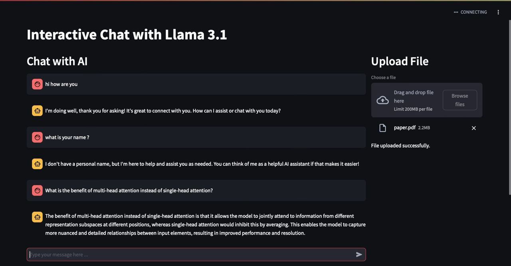
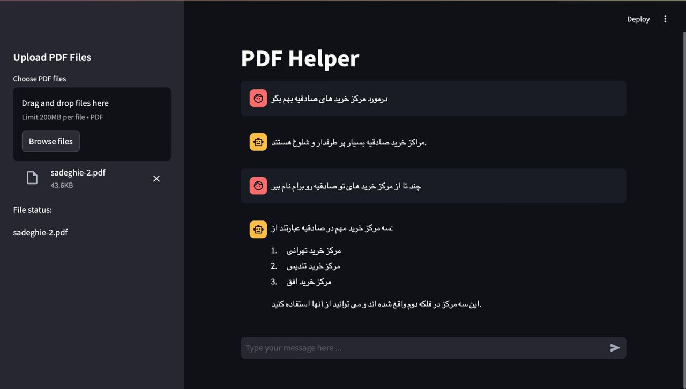
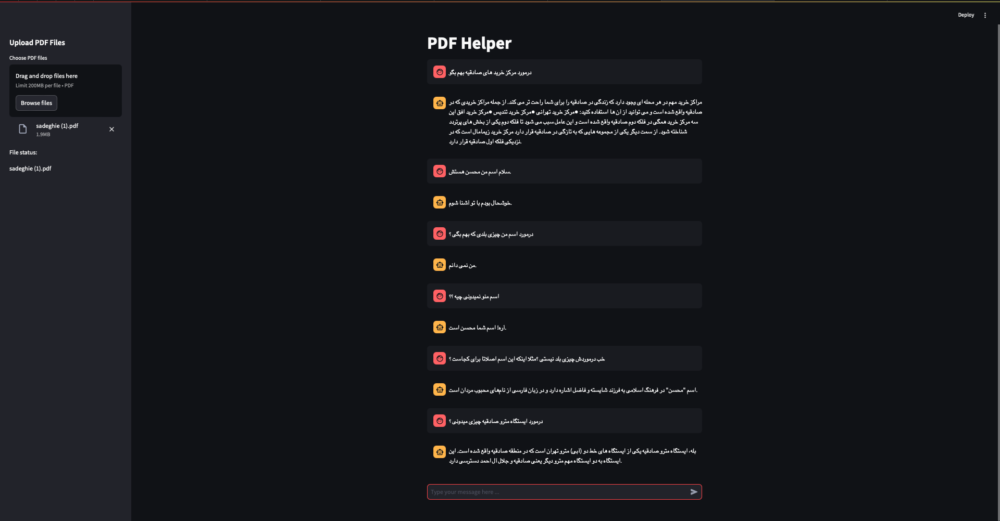

# RAG System Project

This project implements a Retrieval-Augmented Generation (RAG) system using LangChain across multiple versions, each with distinct features and improvements. The system leverages the Milvus database for vector search, and for all versions, we use the top 3 k-nearest vectors to connect to the LLM model via LM Studio.

## Table of Contents

- [Version 0.1](#version-01)
- [Version 0.2](#version-02)
- [Version 0.3](#version-03)
- [Version 0.4](#version-04)
- [Notebooks](#notebooks)
- [Installation](#installation)

---

## Version 0.1

### Features:
- **Basic RAG System**: Connects to Milvus without any third-party libraries.
- **Search Method**: Uses Cosine similarity (default parameter for Milvus).
- **Milvus Database Structure**:
    - `id`
    - `vector`
    - `text`
    - `subject` (default setter to `history`)
- **Sentence Embedding Model**: `sentence-transformers/all-MiniLM-L6-v2`
- **Interactive App**: Built with Streamlit for an interactive data experience.

### Usage:
1. Install the required packages from `requirements.txt`.
2. Run the project using:
   ```bash
   python3.10 main.py
   ```
### Images:


---
## Version 0.2

### Features:
- **UI Update**: Improved user interface compared to Version 0.1.

### Usage:
1. Install the required packages from `requirements.txt`.
2. Run the project using:
   ```bash
   python3.10 main.py
   ```
   
### Images:


---
## Version 0.3

### Features:
- **LangChain Integration**: Added LangChain to connect Milvus search and create chains for easier use.
- **Code Restructuring**: The project is now organized into two directories:
  - `core`
  - `utils`
- **History Feature**: The history feature is available but has poor performance in this version.

### Usage:
1. Install the required packages from `requirements.txt`.
2. Run the project using:
   ```bash
   cd core
   python3.10 app.py
   ```
   
---

## Version 0.4

### Features:
- **Prompt Template Update**: Updated to a meta template for better output and improved history functioning.
- **Embedding Model**: Changed to nomic-embed-text v1.5 with Q5_K_M quantization for better performance on limited resources.
- **LLM Model**: Now uses Llama 3.1 8B with Q3_K_L quantization for enhanced performance on limited resources.

### Usage:
1. Install the required packages from `requirements.txt`.
2. Run the project using:
   ```bash
   cd core
   python3.10 app.py
   ```

### Images:


---
## Notebooks

### nomic-embed-testing
This notebook is dedicated to testing the `nomic-embed-text v1.5` embedding model. It explores the model's performance, including vectorization accuracy and efficiency, especially when using `Q5_K_M` quantization. The goal is to evaluate how well this embedding model fits within the RAG system, particularly in scenarios with limited computational resources.

### Llama3.1-quantization-testing
This notebook focuses on testing the `Llama 3.1 8B` language model with different quantizations. It assesses the model's performance in generating responses, its resource consumption, and how well it integrates with the RAG system. The testing includes various quantization levels to ensure optimal balance between performance and resource usage, making it suitable for environments with limited hardware capabilities.

---
## Installation

1. Clone the repository using:
    ```bash
    git clone git@github.com:woxane/Rag-System.git
    ```
2. Install the required dependencies:
    ```bash
    pip install -r requirements.txt
    ```
3. Run the specific version you want (look out Usage for each version<3).